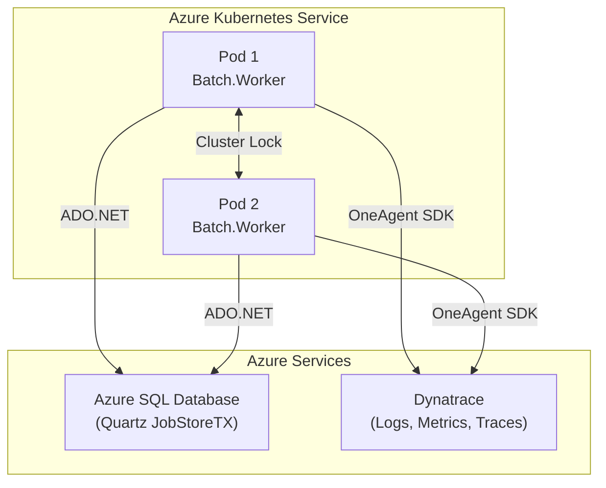

# BatchScheduler — Quartz.NET on AKS with Dynatrace

Production-ready batch processing application using Quartz.NET with persistent scheduling in Azure SQL Database, deployed to Azure Kubernetes Service, with full Dynatrace observability.

## Architecture



## Solution Structure

```
BatchScheduler.sln
├── src/
│   ├── Batch.Domain/           # Interfaces, models, constants (no dependencies)
│   ├── Batch.Observability/    # Dynatrace SDK, metrics, log correlation
│   ├── Batch.Application/      # Job implementations, listeners
│   ├── Batch.Infrastructure/   # Quartz config, DI wiring, options
│   └── Batch.Worker/           # Entry point, health checks, appsettings
├── tests/
│   ├── Batch.UnitTests/        # Unit tests with NSubstitute + FluentAssertions
│   └── Batch.IntegrationTests/ # In-memory Quartz integration tests
├── deploy/
│   ├── sql/                    # Quartz DDL for Azure SQL Database
│   ├── docker/                 # Multi-stage Dockerfile
│   ├── helm/                   # Helm chart for AKS
│   └── k8s/                    # Raw Kubernetes manifests
└── docs/
```

## Prerequisites

- .NET 8 SDK
- Docker (for container builds)
- Azure SQL Database (or SQL Server for local dev)
- kubectl + Helm 3 (for AKS deployment)
- Dynatrace environment with OneAgent Operator on AKS

## Quick Start

### Build

```bash
dotnet restore BatchScheduler.sln
dotnet build BatchScheduler.sln -c Release
```

### Run Locally

1. Start a local SQL Server (e.g., via Docker):
```bash
docker run -e "ACCEPT_EULA=Y" -e "SA_PASSWORD=YourStrong!Passw0rd" \
  -p 1433:1433 -d mcr.microsoft.com/mssql/server:2022-latest
```

2. Initialize Quartz tables:
```bash
sqlcmd -S localhost,1433 -U sa -P "YourStrong!Passw0rd" -d master \
  -Q "CREATE DATABASE QuartzDB"
sqlcmd -S localhost,1433 -U sa -P "YourStrong!Passw0rd" -d QuartzDB \
  -i deploy/sql/001-quartz-tables.sql
```

3. Run the application:
```bash
dotnet run --project src/Batch.Worker
```

The app uses `appsettings.Development.json` by default, which connects to `localhost:1433`.

### Run Tests

```bash
dotnet test BatchScheduler.sln
```

## Azure SQL Database Setup

### 1. Create the Database

```bash
az sql server create --name myquartzserver --resource-group mygroup \
  --location eastus --admin-user sqladmin --admin-password <password>

az sql db create --resource-group mygroup --server myquartzserver \
  --name QuartzDB --service-objective S1
```

### 2. Initialize Quartz Tables

Run `deploy/sql/001-quartz-tables.sql` against your Azure SQL Database:

```bash
sqlcmd -S myquartzserver.database.windows.net -d QuartzDB \
  -U sqladmin -P <password> -i deploy/sql/001-quartz-tables.sql
```

### 3. Configure Connection String

For **Managed Identity** (recommended on AKS):
```
Server=tcp:myquartzserver.database.windows.net,1433;Database=QuartzDB;Authentication=Active Directory Managed Identity;Encrypt=true;TrustServerCertificate=false
```

For **SQL Auth** (development only):
```
Server=tcp:myquartzserver.database.windows.net,1433;Database=QuartzDB;User Id=sqladmin;Password=<password>;Encrypt=true;TrustServerCertificate=false
```

## AKS Deployment

### Using Helm

```bash
# Build and push container image
docker build -f deploy/docker/Dockerfile -t yourregistry.azurecr.io/batch-scheduler:1.0.0 .
docker push yourregistry.azurecr.io/batch-scheduler:1.0.0

# Create secret for connection string
kubectl create namespace batch-scheduler
kubectl create secret generic batch-scheduler-secrets \
  --namespace batch-scheduler \
  --from-literal=ConnectionStrings__QuartzDatabase="<your-connection-string>"

# Deploy with Helm
helm install batch-scheduler deploy/helm \
  --namespace batch-scheduler \
  --set image.repository=yourregistry.azurecr.io/batch-scheduler \
  --set image.tag=1.0.0
```

### Using Raw Manifests

```bash
kubectl apply -f deploy/k8s/namespace.yaml
kubectl apply -f deploy/k8s/configmap.yaml
kubectl apply -f deploy/k8s/secret.yaml    # Edit with your connection string first
kubectl apply -f deploy/k8s/deployment.yaml
```

## Configuration

All settings are configurable via `appsettings.json`, environment variables, or Kubernetes ConfigMaps.

| Setting | Default | Description |
|---------|---------|-------------|
| `Quartz:SchedulerName` | BatchScheduler | Scheduler identity name |
| `Quartz:InstanceId` | AUTO | Instance ID (AUTO = hostname-based) |
| `Quartz:ThreadPoolSize` | 10 | Max concurrent job threads |
| `Quartz:Clustered` | true | Enable cluster mode for multiple pods |
| `Quartz:ClusterCheckinIntervalMs` | 15000 | Cluster heartbeat interval |
| `Quartz:MisfireThresholdMs` | 60000 | Misfire detection threshold |
| `JobSchedules:RecurringJob:CronExpression` | 0 0/5 * * * ? | Every 5 minutes |
| `JobSchedules:RecurringJob:BatchSize` | 100 | Items per batch run |
| `JobSchedules:OneTimeJob:Enabled` | true | Enable one-time startup job |

## Dynatrace Observability

### What Dynatrace Auto-Instruments (OneAgent)

| Component | Auto-Instrumented |
|-----------|:-:|
| ADO.NET / SqlClient (Quartz DB queries) | Yes |
| HttpClient (if jobs make HTTP calls) | Yes |
| .NET runtime metrics (GC, threads) | Yes |

### What This Application Manually Instruments

| Component | SDK Feature Used | Why |
|-----------|-----------------|-----|
| Job execution boundaries | `TraceIncomingRemoteCall` | Creates PurePath entry point per job run |
| Job metadata | `AddCustomRequestAttribute` | Enables filtering by job name/group in Dynatrace |
| Log-trace correlation | `TraceContextInfo` | Adds `dt.trace_id`/`dt.span_id` to structured logs |

### Metrics Emitted

| Metric | Type | Tags |
|--------|------|------|
| `batch.job.started` | Counter | job.name, job.group |
| `batch.job.succeeded` | Counter | job.name, job.group |
| `batch.job.failed` | Counter | job.name, job.group, exception.type |
| `batch.job.duration` | Histogram (ms) | job.name, job.group |
| `batch.job.retries` | Counter | job.name, job.group |
| `batch.job.misfires` | Counter | job.name, job.group |

### Structured Log Fields

Every log entry within a job execution includes:

- `job.name`, `job.group` — job identity
- `trigger.name`, `trigger.group` — trigger identity
- `job.fireInstanceId` — unique execution ID
- `job.scheduledFireTime` — when the job was supposed to fire
- `dt.trace_id`, `dt.span_id` — Dynatrace PurePath correlation

### Validating in Dynatrace

1. **Traces**: Navigate to *Distributed Traces* > filter by service "BatchScheduler"
2. **Metrics**: Navigate to *Metrics* > search for `batch.job.*`
3. **Logs**: Navigate to *Logs* > filter by `job.name` or `dt.trace_id`
4. **Service Flow**: The job executions appear as service entry points with downstream SQL calls visible

## Known Limitations

- **Quartz.NET table initialization** is a manual step — no auto-migration is included
- **HPA for batch schedulers** requires careful tuning to avoid duplicate job execution
- **OneAgent SDK** provides tracing only when the Dynatrace OneAgent process is running on the node
- **System.Diagnostics.Metrics** require Dynatrace OneAgent 1.251+ for automatic collection
- **Clustered mode** requires all pods to access the same Azure SQL Database instance

## Production Hardening Checklist

- [ ] Use Azure Managed Identity instead of SQL authentication
- [ ] Enable Azure SQL Database auditing and threat detection
- [ ] Configure Azure SQL Database firewall to allow only AKS VNet
- [ ] Set `DOTNET_gcServer=1` for server GC in containers
- [ ] Configure PodDisruptionBudget to maintain scheduler availability
- [ ] Monitor `QRTZ_FIRED_TRIGGERS` table size for cleanup needs
- [ ] Set up Dynatrace alerting on `batch.job.failed` counter
- [ ] Review Quartz misfire threshold vs. pod restart time
- [ ] Enable TLS 1.2+ for all database connections
- [ ] Rotate secrets via Azure Key Vault + CSI driver
